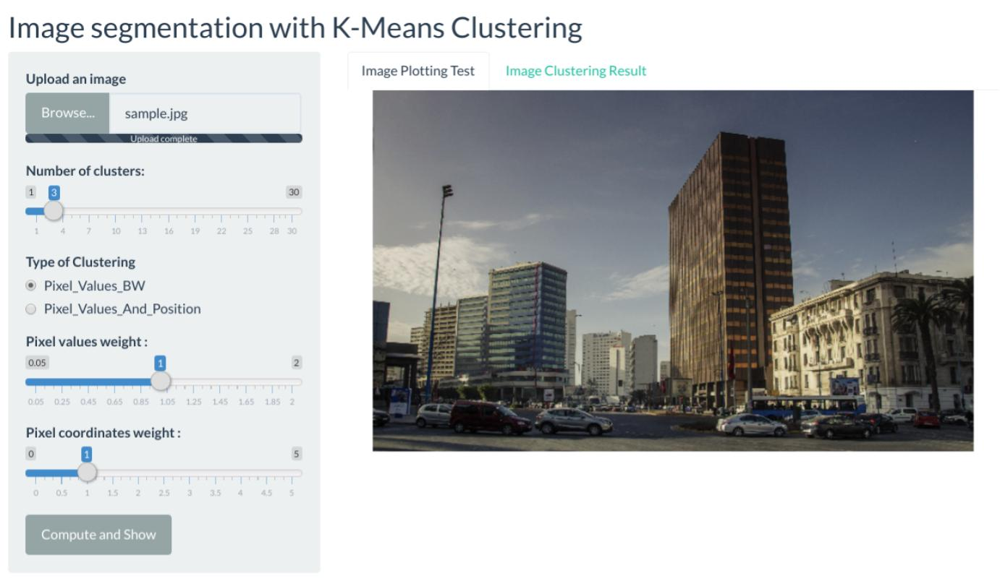
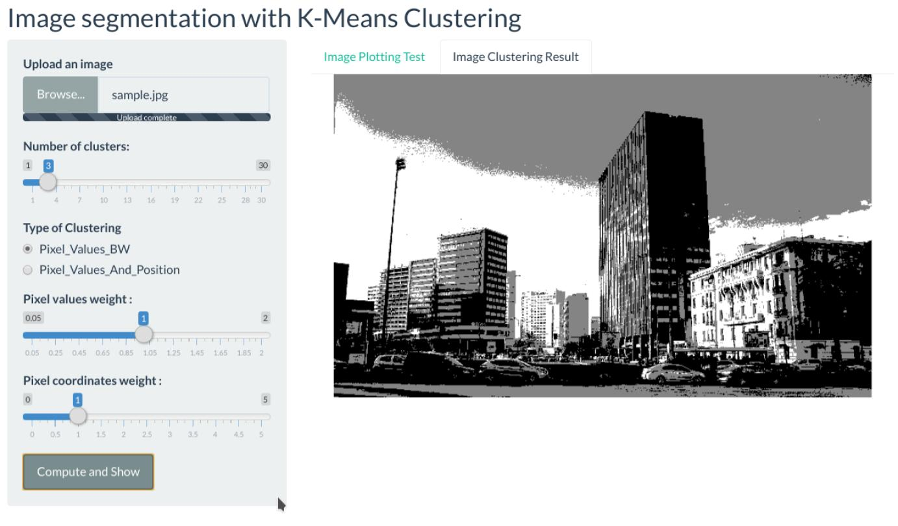
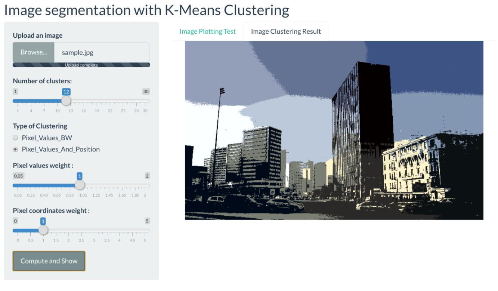

# PlayNLearn_Clustering-For-Images
An interactive shiny based Web Application for testing and visualizing unsupervised k-means clustering effects on images.

Try it NOW ! >>>> >>>> >>>> **[link to the web application ]( https://mis-emi-2019.shinyapps.io/PlayNLearnClustering/).**

## UI Screenshot  
### Loading Image
  
### Clustering Option 1 : Pixel values based clustering + GrayScale Rendering
  
### Clustering Option 2 : Pixel values + Pixel Coordinates based clustering + RGB Rendering
  
